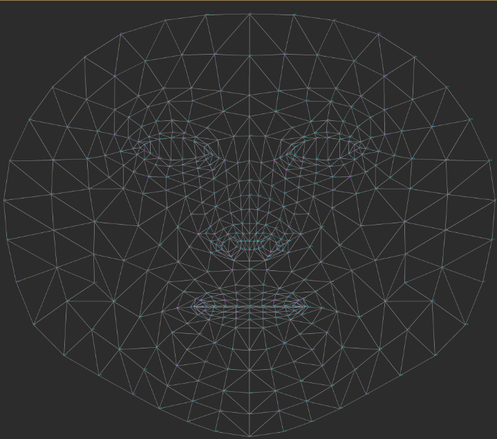
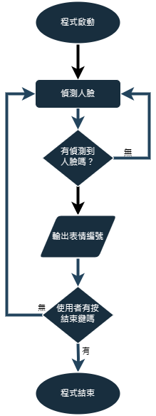

# 表情辨識與肌肉分析

本專案以 MediaPipe Face Mesh 進行臉部特徵點偵測，結合臉部肌肉動作單元（Action Unit, AU）與表情分類資料，分析不同表情牽動的臉部肌肉位置。研究目標是把表情辨識結果轉換成可視覺化的肌肉活動資訊，未來可延伸到中風、面癱或其他臉部活動不協調情況的初步觀察與復健輔助。



## 專題重點

- 使用 MediaPipe Face Mesh 擷取臉部 468 個 3D 特徵點。
- 依照 AU 表情特性，找出表情與臉部肌肉群的對應關係。
- 以特徵點座標與距離作為表情分類特徵，建立可供模型訓練的 CSV 資料。
- 透過重心座標插值補足肌肉位置不完全落在特徵點上的情況，提高視覺化位置的準確度。
- 規劃結合 CBAM 注意力機制，提升表情辨識模型對重要臉部區域的關注能力。

## 系統流程

報告中的系統設計流程如下：影像由設備端輸入後送至伺服器，伺服器進行表情辨識，再依照辨識結果與 AU 對應表，透過 MP_FACE 標記牽涉的肌肉部位，最後回傳已標記的影像。



目前此 repo 主要保留早期測試與資料處理程式，包含特徵點擷取、指定 landmark 顯示、座標/距離輸出，以及 Random Forest 訓練資料連結。

## 專題成果

專題成果顯示，透過臉部網格、AU 對應與重心插值，可以將不同表情牽動的肌肉群標記在影像上，讓使用者更直觀地觀察臉部肌肉活動。


## 資料集

資料放在 `data/` 目錄中，分成四種表情類別：

```text
data/
├── disgusted/    約 200 張圖片
├── happy/        約 200 張圖片
├── sad/          約 200 張圖片
└── surprised/    約 200 張圖片
```

`modle.py` 目前使用的類別標籤如下：

```text
disgusted = 1
happy     = 2
surprised = 3
sad       = 4
```

## 專案結構

```text
.
├── data/                         # 表情圖片資料集
├── docs/images/                  # README 使用的報告圖片
├── code/main.py                  # 攝影機即時顯示指定臉部特徵點
├── code/test1.py                 # 測試指定特徵點並輸出距離資料
├── code/test3.py                 # 早期單張圖片特徵點距離測試
├── code/math_1.py                # 座標與距離計算測試
├── code/math_2.py                # 座標與距離計算測試
├── modle.py                      # FaceMeshDetector，批次擷取 landmark 距離並寫入 CSV
├── tool2.py                      # 批次呼叫 FaceMeshDetector 的資料產生腳本
├── distancesave .csv             # 訓練資料輸出
├── distancesavetest.csv          # 測試資料輸出
└── RandomForestClassifier.ipynb.url
```

## 安裝環境

建議使用 Python 3.9，並先建立獨立虛擬環境。

```bash
pip install opencv-python mediapipe pillow scikit-learn pandas numpy
```

如果只要執行 MediaPipe 特徵點偵測，可先安裝：

```bash
pip install opencv-python mediapipe pillow
```

## 使用方式

### 1. 批次產生 landmark 距離資料

先修改 `tool2.py` 內的圖片路徑與表情類別，例如：

```python
for i in range(1, 201):
    detector.detect(r"data/sad/sad({}).jpg".format(i))
```

執行：

```bash
python tool2.py
```

程式會呼叫 `modle.py` 中的 `FaceMeshDetector.detect()`，將指定 landmark 的距離特徵寫入 `distancesave .csv`。

### 2. 即時顯示臉部特徵點

```bash
python code/main.py
```

此程式會開啟攝影機，使用 MediaPipe Face Mesh 偵測臉部，並在畫面上標示指定特徵點座標。按 `Esc` 可結束程式。

### 3. 訓練表情分類模型

開啟 `RandomForestClassifier.ipynb.url` 指向的 Google Colab notebook，載入 CSV 特徵資料後，可進行 Random Forest 分類模型訓練與測試。

## 後續方向

- 將系統與 App Inventor 或手機端應用整合，透過手機攝影機即時送出影像並回傳肌肉標記結果。
- 加入眼部與臉部肌肉微動態分析，用於觀察視線、微表情與臉部活動變化。
- 建立更完整的深度學習模型，結合 CNN、RNN 與注意力機制，提高表情辨識與肌肉監測準確度。
- 擴充醫療與復健情境，讓臉部活動不協調的偵測結果可作為診斷或復健追蹤參考。

## 注意事項

- `tool2.py` 與部分測試程式仍保留舊的絕對路徑，執行前需要改成本機資料集路徑。
- 檔名 `modle.py` 可能是 `model.py` 的拼字誤植；若重新整理專案，需同步調整 import。
- `distancesave .csv` 檔名中含有空格，讀取時請注意完整檔名。
